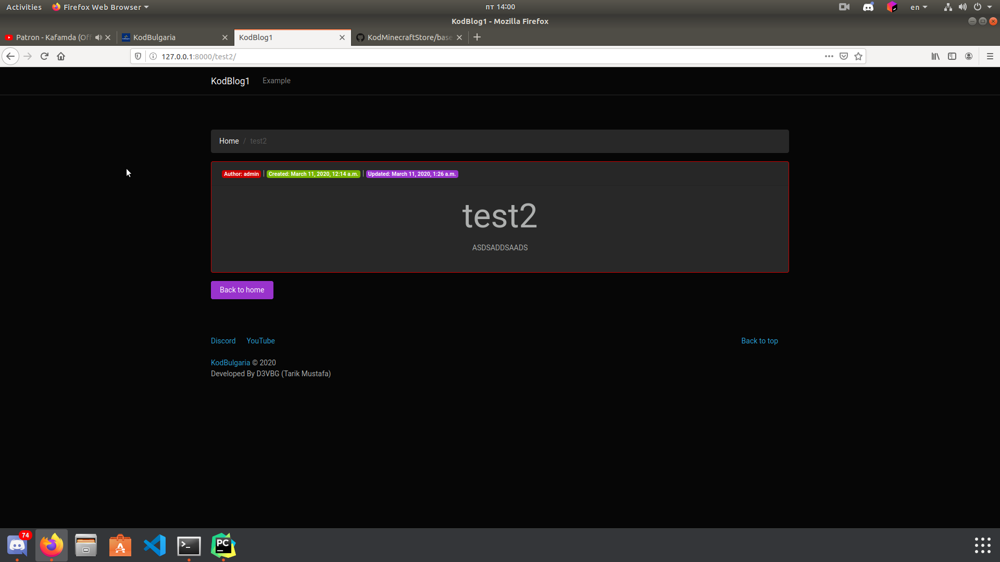
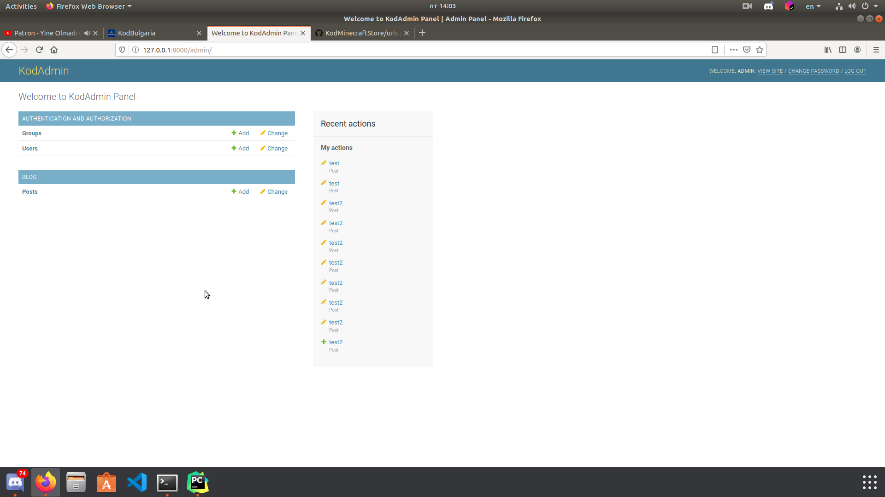

# KodBlog1
KodBlog1 is Blog project written in Python (Django Framework)
### Versions
- Python - 3
- Django - 3
- Bootstrap - 4
- jQuery - 3
### Developers
- Tarik Mustafa (D3VBG)
### Requirements
```shell script
pip3 install -r requirements.txt
```
###Run
```shell script
python manage.py runserver
```
###Admin panel
go to your-site.com/admin or 127.0.0.1:8000/admin
```
username: admin
password: admin
```
###Images



